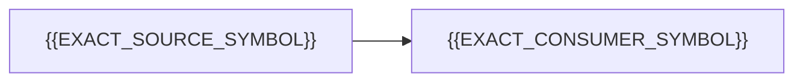

## Overview

[PR #{{CURRENT_PR_NUMBER}}]({{CURRENT_PR_URL}}) {{PURPOSE_AND_STACK_POSITION}}.

> [!IMPORTANT]
> Review [PR #{{CURRENT_PR_NUMBER}}]({{CURRENT_PR_URL}}){{REVIEW_ORDER_SUFFIX}}.

{{ONE_SENTENCE_OUTCOME}}

<!--
Optional architecture section. Remove this complete section when a diagram does not improve the review.
Add a second diagram only when a before-and-after comparison is necessary.
Render and visually inspect every final Mermaid diagram before publication.
-->

### Architecture



{{DIAGRAM_FACT_NOT_VISIBLE_IN_DIAGRAM}}

### Decision map

| # | Decision | Result |
|---:|---|---|
| 1 | {{DECISION_NAME}} | `{{EXACT_SYMBOL}}` {{EXACT_RESULT}}. |

## Review walkthrough

Review Steps 1 through {{STEP_COUNT}}. The order follows {{DEPENDENCY_OR_EXECUTION_FLOW}}.

> [!TIP]
> Each file panel links to the GitHub diff. Inline diffs show literal excerpts only. Use Files changed for comments.

| Changed files | Diff | Focused tests | Stack position |
|---:|---:|---:|---:|
| {{CHANGED_FILE_COUNT}} | {{ADDITIONS}} / {{DELETIONS}} | {{EXACT_TEST_RESULT}} | {{STACK_POSITION_OR_STANDALONE}} |

`WHY` gives the problem. `PRINCIPLE` gives the design rule. `STEP` gives the review order. `KEPT` gives deliberate non-changes.

<details>
<summary><kbd>WHY</kbd> <strong>0: Starting point</strong> - {{EXACT_PROBLEM}}.</summary>

<br />

- `{{EXACT_SYMBOL}}` {{PRIOR_BEHAVIOR}}.
- `{{EXACT_CALLER}}` {{PRIOR_CALL_PATH}}.

</details>

<details>
<summary><kbd>PRINCIPLE</kbd> <strong>Design rule</strong> - {{EXACT_DESIGN_RULE}}.</summary>

<br />

- `{{EXACT_COMPONENT_A}}` {{RESPONSIBILITY_A}}.
- `{{EXACT_COMPONENT_B}}` {{RESPONSIBILITY_B}}.

</details>

<details>
<summary><kbd>STEP 1</kbd> <strong>{{STEP_TITLE}}</strong> - {{STEP_OUTCOME}}.</summary>

<br />

**Before this PR.** `{{EXACT_OLD_SYMBOL}}` {{EXACT_OLD_BEHAVIOR}}.

**This PR.** `{{EXACT_NEW_SYMBOL}}` {{EXACT_NEW_BEHAVIOR}}.

<details>
<summary><kbd>{{FILE_STATUS}}</kbd> <strong>{{FILE_NAME}}</strong> - {{FILE_DECISION}}.</summary>

<br />

{{FILE_EXPLANATION_WITH_EXACT_SYMBOLS}}

```diff
{{LITERAL_BASE_TO_HEAD_DIFF_EXCERPT}}
```

[Open the `{{FILE_NAME}}` diff]({{CURRENT_PR_URL}}/files#diff-{{SHA256_FILE_PATH}})

</details>

</details>

<details>
<summary><kbd>KEPT</kbd> <strong>Deliberately unchanged</strong> - {{UNCHANGED_BOUNDARY}}.</summary>

<br />

- `{{EXACT_SYMBOL}}` still {{EXACT_UNCHANGED_BEHAVIOR}}.

</details>

## Decision record

<details>
<summary><strong>1. {{DECISION_TITLE}}</strong></summary>

<br />

**Decision.** `{{EXACT_SYMBOL}}` {{DECISION}}.

**Before this PR.** `{{EXACT_OLD_SYMBOL}}` {{EXACT_OLD_BEHAVIOR}}.

**Reason.** {{REASON}}.

**Alternatives not selected.** {{ALTERNATIVES}}.

**Result.** {{EXACT_RESULT}}.

**Review questions.** Does `{{EXACT_SYMBOL}}` {{EXACT_REVIEW_QUESTION}}?

<details>
<summary>Principal diff</summary>

<br />

```diff
{{LITERAL_BASE_TO_HEAD_DIFF_EXCERPT}}
```

</details>

[Open the `{{FILE_NAME}}` diff]({{CURRENT_PR_URL}}/files#diff-{{SHA256_FILE_PATH}})

</details>

## Deliberate non-goals

- This pull request does not {{EXACT_NON_GOAL}}.

## Evidence and verification

| Boundary | Evidence |
|---|---|
| `{{EXACT_BOUNDARY}}` | `{{EXACT_TEST_FILE}}` covers {{EXACT_BEHAVIOR}}. |

These checks passed on `{{EXACT_HEAD_SHA}}`:

- `{{EXACT_COMMAND}}`: {{EXACT_RESULT}}

Checks not run:

- {{EXACT_CHECK_OR_NONE}}

[Open the live pull request checks]({{CURRENT_PR_URL}}/checks)

<!-- Remove this section for a standalone pull request. -->

## Stack

- GitHub stack #{{STACK_NUMBER}} uses `{{STACK_BASE}}` as its base.
- Position {{POSITION}}: [PR #{{PR_NUMBER}}]({{PR_URL}}), `{{HEAD_BRANCH}}` → `{{BASE_BRANCH}}`
